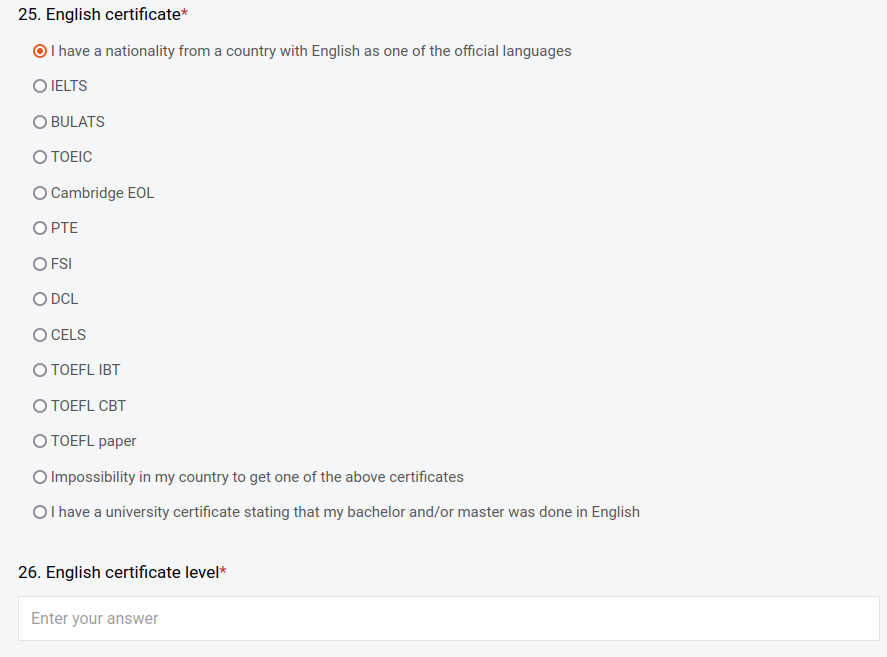
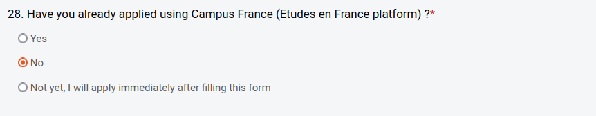
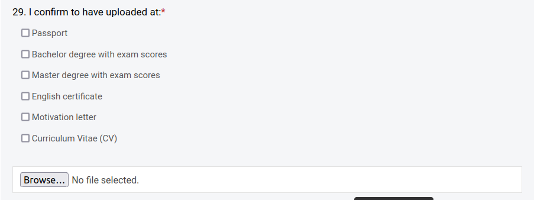
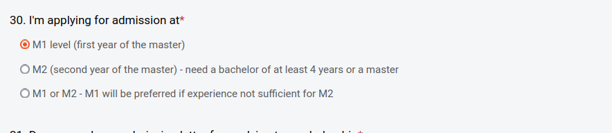
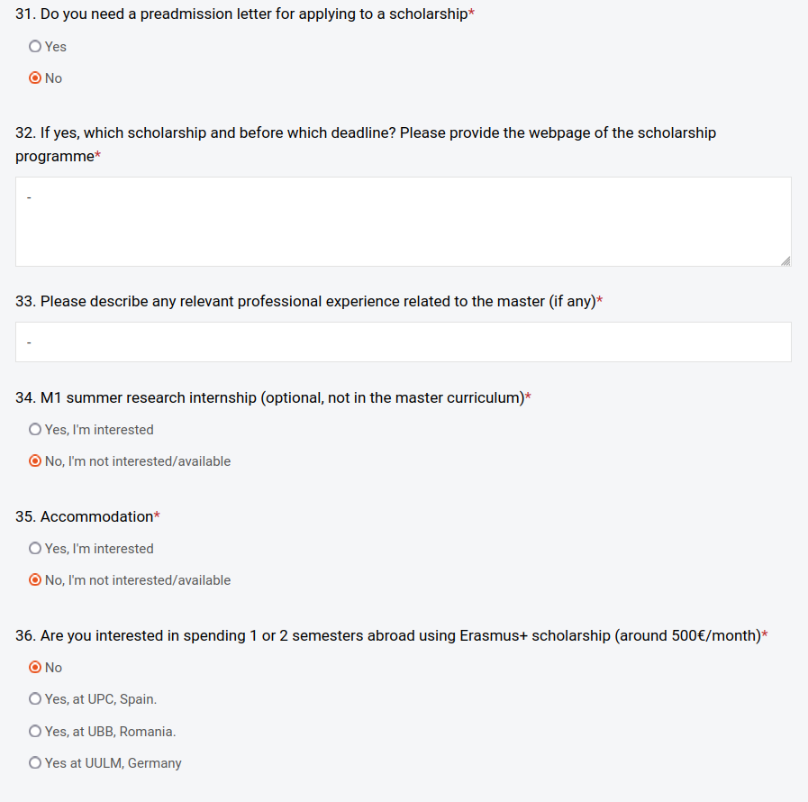

 # Подача заявки на участь у проєкті AI4CI

 ## Зміст
 1. [Загальні відомості](#загальні-відомості)
 1. [Подача заявки на участь](#подача-заявки-на-участь)
 1. [Питання-відповіді](#питання-відповіді)

 ## Загальні відомості
 КПІ ім. Ігоря Сікорського (зокрема кафедра ОТ) приймає участь у проєкті Artificial Intelligence for Connected Industries (AI4CI) — просимо долучитись та скористатись можливостями цієї програми для магістрів. Це перша європейська ініціатива, яка спрямована на інтеграцію штучного інтелекту у такі галузі як робототехніка, Інтернет речей (IoT) та хмарні обчислення з метою подолання дефіциту кваліфікованих кадрів у сфері ШІ та підсилити конкурентоспроможність ЄС та України у цифрових інноваціях. Основна мета проєкту — створити спільну магістерську програму між провідними університетами Європи та України для підготовки фахівців, які зможуть застосовувати ШІ у різних секторах індустрії.

  ## Подача заявки на участь

  1. Зареєструйтесь на сайті: [https://ai4ci.eu/](https://ai4ci.eu/)
  
  1. Відкрийте та зповніть форму для подання заявки: [https://ai4ci.eu/ntuu-application-form/](https://ai4ci.eu/ntuu-application-form/)
  
  1. По завершенню процесу подачі application form надішліть повідомлення через Телеграм до викладача [Гордієнко Юрій Григорович](https://t.me/yoctoman) із зазначенням своїх 

- ПІБ укр-мовою + група,
- `Name`, `Surname` на латині так, як Ви вносили у веб-форму.
  

  ## Питання-відповіді 
  - У полі **14. Full address (home country)** адресу писати латиницею?
  
> Так, латиницею.

- У полі **15. Full address (France) - if known and different from the one above** ставити прочерк чи скопіювати інформацію з попереднього поля 14?

> Поставте прочерк `-`

- У полі **16.  Bachelor title (as written in the bachelor certificate)** мається на увазі тема чи що?

> Вкажіть назву спеціальності з диплому бакалавра англійською мовою.

- У всіх полях пов'язаних з магістратурою (20-23) ставити прочерк? Що робити з полем дати?

> 20. `-`
> 21. `-`
> 22. `-`
> 23. Поставте орієнтований рік та місяць закінчення навчання у магістратурі.

- Що ставити у полі **24. French language certificate level (if any)**?

> Поставте прочерк `-`, якщо немає такого сертифікату.

- Якщо немає сертифікату, що тоді ставити у полі **25. English certificate**? Відповідно у полі 26 ставити прочерк чи приблизний рівень володіння англійською написати?
> У такому випадку просто оберіть перший пункт: `I have a nationality from a country with English as one of the official languages`
 
> У полі 26 поставте прочерк `-`, якщо немає підтверджуючого сертифікату.

- Що ставити у полі **27. French level and certificate type (if any)**?

> Поставте прочерк `-`, якщо немає такого сертифікату.

- Що ставити у полі **28. Have you already applied using Campus France (Etudes en France platform)?**

> Оберіть  `No`

- У полі **29. I confirm to have uploaded at:** потрібно щось одне завантажити чи обрати усе по максимуму? Що робити з мотиваційним листом та резюме?

> Варто завантажити усе, що є у Вас з поданого списку. Мотиваційний лист та резюме подайте у довільній формі англійською мовою.

- Що ставити у полі **30. I'm applying for admission at**?

> Якщо Ви магістр першого року навчання -- **М1**, а якщо другого -- **М2**.

- І в полях 31-36 просто `No` і прочерки ж, правда?

>  Так, прочерк `-` або `No`, оскільки це питання ще не врегульовано для українських студентів.