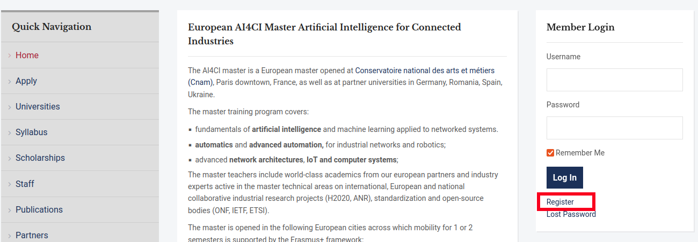
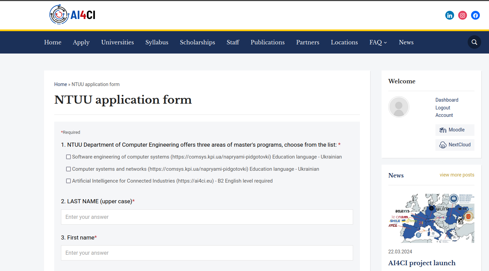
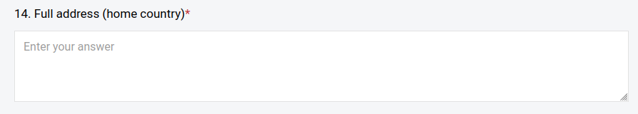
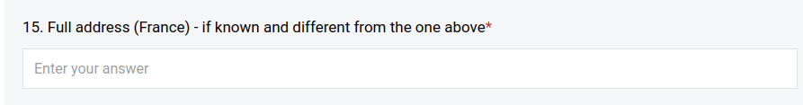
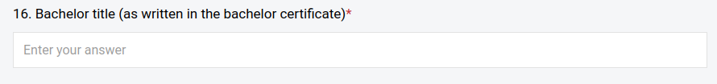
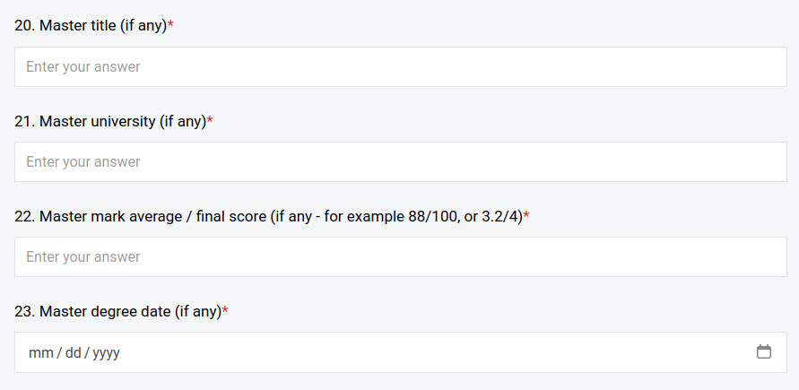
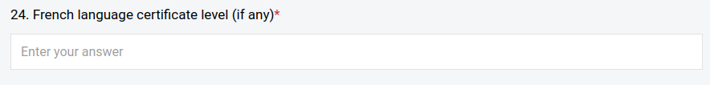
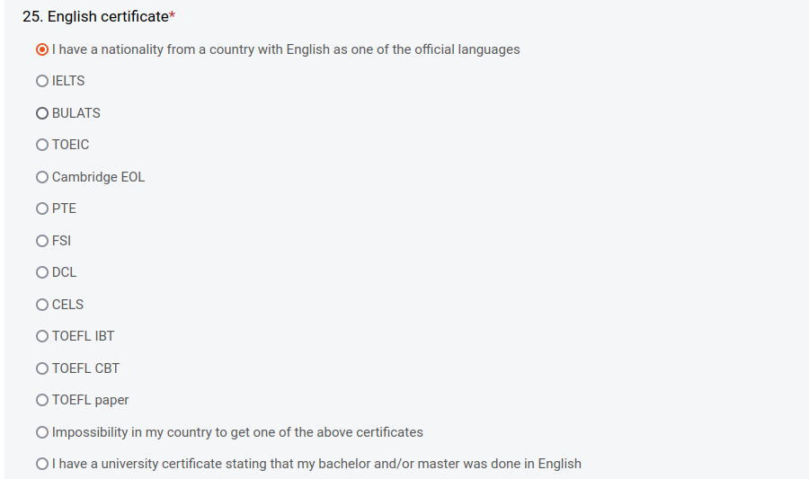

 # Подача заявки на участь у проєкті AI4CI

 ## Зміст
 1. [Загальні відомості](#загальні-відомості)
 1. [Подача заявки на участь](#подача-заявки-на-участь)
 1. [Питання-відповіді](#питання-відповіді)

 ## Загальні відомості
 КПІ ім. Ігоря Сікорського (зокрема кафедра ОТ) приймає участь у проєкті Artificial Intelligence for Connected Industries (AI4CI) — просимо долучитись та скористатись можливостями цієї програми для магістрів. Це перша європейська ініціатива, яка спрямована на інтеграцію штучного інтелекту у такі галузі як робототехніка, Інтернет речей (IoT) та хмарні обчислення з метою подолання дефіциту кваліфікованих кадрів у сфері ШІ та підсилити конкурентоспроможність ЄС та України у цифрових інноваціях. Основна мета проєкту — створити спільну магістерську програму між провідними університетами Європи та України для підготовки фахівців, які зможуть застосовувати ШІ у різних секторах індустрії.

  ## Подача заявки на участь

  1. Зареєструйтесь на сайті: [https://ai4ci.eu/](https://ai4ci.eu/)
  
  1. Відкрийте посилання для подання заявки: [https://ai4ci.eu/ntuu-application-form/](https://ai4ci.eu/ntuu-application-form/)
  1. Заповніть форму, що відкриється 
  

  ## Питання-відповіді 
  - У полі **14. Full address (home country)** адресу писати латиницею?
  
> Так, латиницею.

- У полі **15. Full address (France) - if known and different from the one above** ставити прочерк чи скопіювати інформацію з попереднього поля 14?

> Поставте прочерк `-`

- У полі **16.  Bachelor title (as written in the bachelor certificate)** мається на увазі тема чи що?

> Вкажіть назву спеціальності з диплому бакалавра англійською мовою.

- У всіх полях пов'язаних з магістратурою (20-23) ставити прочерк? Що робити з полем дати?

> 20. `-`
> 21. `-`
> 22. `-`
> 23. Поставте орієнтований рік та місяць закінчення навчання у магістратурі.

- Що ставити у полі **24. French language certificate level (if any)**?

> Поставте прочерк `-`, якщо немає такого сертифікату.

- Людям без сертифікату з англійської В2+ немає сенсу реєструватися?
> Є сенс реєструватись. Більшість студентів не має офіційного сертифікату про володіння англійською мовою. У такому випадку просто оберіть перший пункт для поля **25. English certificate**: 

